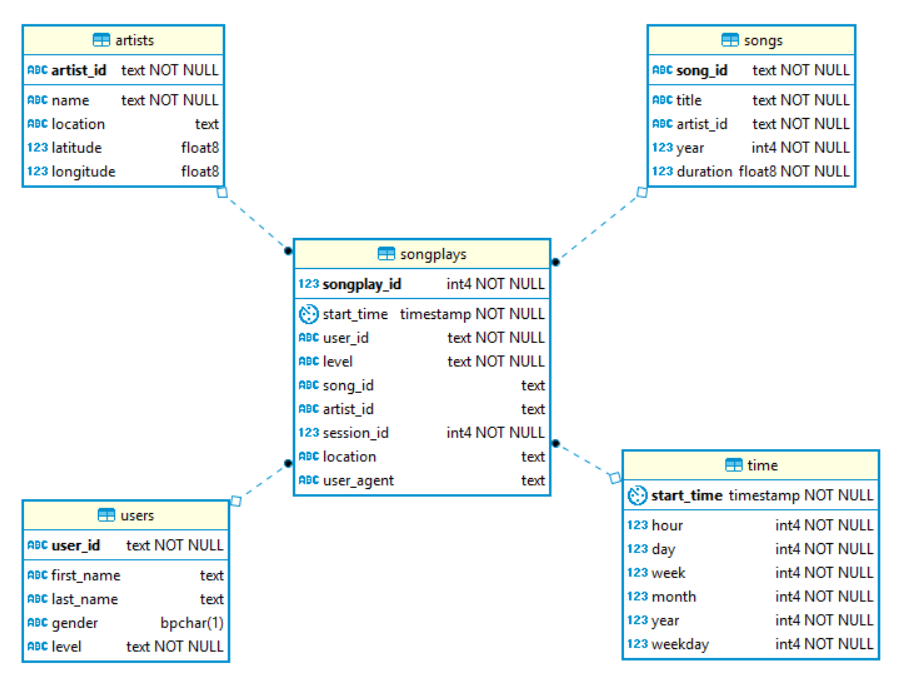

# Udacity - Data Engineering Nanodegree
## Project: Data Modeling with Postgres


### Summary

The startup Sparkify has a music streaming app, and its data related to songs, artists and listening behavior resides in JSON files. There are two main types of files:
* JSON logs on user activity on the app
* JSON metadata on the songs available in the app

Currently, the analytics team of the company is interested in analyzing what songs users of the app are listening to. Therefore, the purpose of this project is to create a database designed to optimize queries on song play analysis, and import the data stored in the JSON files into that database.

### Data model

Since the database for this project is meant to have an optimal performance for complex analytic queries, the schema chosen for the data model was the **star schema**. 

The dimension tables defined for the schema are the attributes that the analytics team is interested to understand in user activity: the actual *users*, the *songs* listened to by the users, the *artists* of those songs, and the *time* identifying when the songs started to be listened to. The fact table was defined to be the actual *songplays* registered by the app.

Resulting physical data model in Postgres:
 


### Creating the database

The creation of the database tables and ETL processes for each table were developed in **Python scripts**.

The script `create_tables.py` creates the database *sparkifydb* and the five tables of the star schema described in the previous section. The `CREATE` and `DROP` statements called by that script are defined in another script, `sql_queries.py`. 

To proceed with the creation of the tables, run the following command in the terminal:

```
python create_tables.py
```

This command can be rerun as much as needed in order to reset the tables, since the script `create_tables.py` also contains statements to drop both the tables and the *sparkifydb* database if they exist.

### Importing the data

Once the tables have been properly created, the database will be ready to be populated with the data stored in the JSON files.

The ETL processes are defined in the file `etl.py`. This script contains a number of Python functions that, together, process all the song and log files in the directories *data/song_data* and *data/log_data* and loads the data in the dimension and fact tables of the *sparkifydb* database. More explanation about the ETL pipeline can be found in the docstring of each function defined in that script.

In order to import the JSON files data into the database, run the following command in the terminal:

```
python etl.py
```

The output of that script shows how many files were processed. Run `test.ipynb` to confirm the records were successfully inserted into each table.
